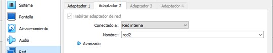
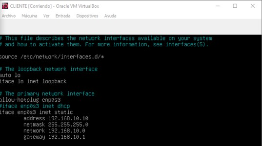
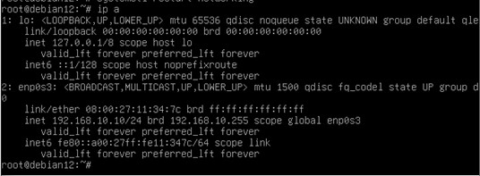
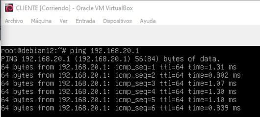

# Configuración del CLIENTE

- Antes de encender nuestra máquina, primero debemos cambiar el adaptador de red. Su adaptador tiene que estar en red interna. Le asignamos un nombre, por ejemplo red2.

- Una vez teniendo el cliente en red interna encendemos la máquina. Cuando esté encendida entramos al archivo de configuración de interfaces de red con el comando **sudo nano /etc/network/interfaces**

- Hemos configurado la red en estática y le hemos asignado una ip.

- Salimos del archivo, guardando antes con Ctrl + o, y reiniciamos el servicio con **systemctl restart networking**.

- A continuación hacemos **ip a** para asegurarnos que se ha asignado correctamente la ip de red.

## Después de configurar el servidor DHCP y RELAY

Para comprobar que hay conectividad entre el servidor DHCP y el cliente hacemos ping al servidor.

Podemos ver que sí hay conectividad.
