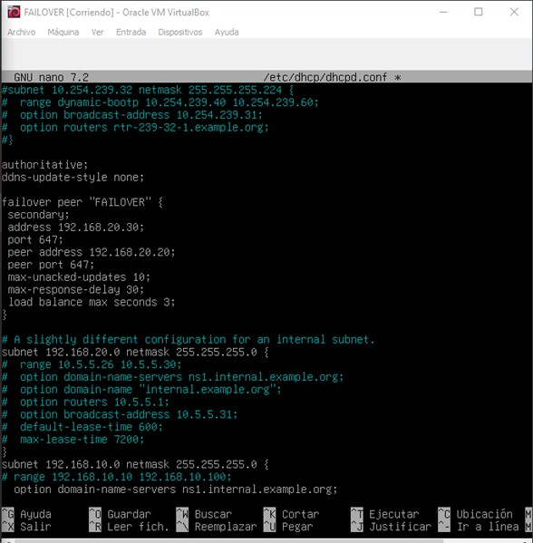
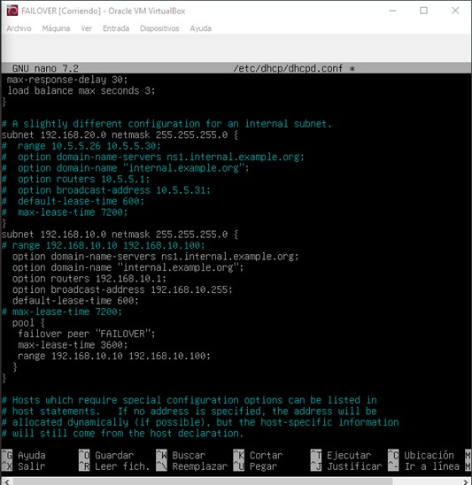

#Configuración de servidor Failover

La función de este servidor es ofrecer sus servicios cuando el servidor principal (DHCP) falle o de problemas.

- Descargamos isc-dhcp-server

-- Cambiamos a red interna y le ponemos la misma que tiene SERVIDOR (red1). 

- Usamos el comando **nano /etc/network/interfaces** y le asignamos una ip estática.

- Reiniciamos el servicio con **systemctl restart networking**

- Configuramos el archivo **/etc/default/isc-dhcp-server** para que el dhcp Failover escuche las peticiones por esa tarjeta, que es la suya.

- Ahora abrimos el archivo **/etc/dhcp/dhcpd.conf** para asignar el mismo rango de ips a cliente, como hicimos en el servidor DHCP.

- 

## Configuración en el servidor DHCP

- En el mismo archivo de antes añadimos lo siguiente:

- Reiniciamos el servicio con **systemctl restart isc-dhcp-server**.

## Configuración en Failover

- En el mismo archivo de antes añadimos lo siguiente:

- Reiniciamos el servicio con **systemctl restart isc-dhcp-server**.

## Configuración en RELAY

- En relay ponemos la ip del failover en **/etc/default/isc-dhcp-relay**

## Configuración en el servidor DHCP

- Paramos el servicio con **systemctl stop isc-dhcp-server.service** para que pueda funcionar el Failover

- A continuación en cliente volvemos a usar **dhclient -r** y **dhclient -v**.

- En el Failover usamos el comando **tail -f /var/lib/dhcp/dhcpd.leases** para ver como el FAILOVER le ha dado servicios a CLIENTE.

