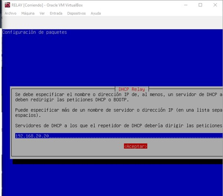
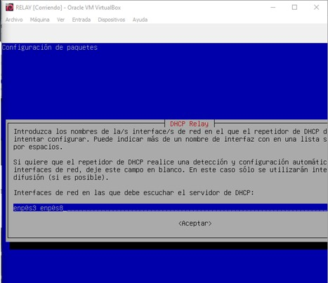
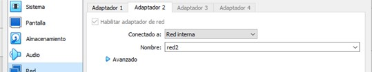
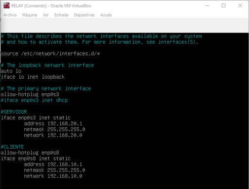
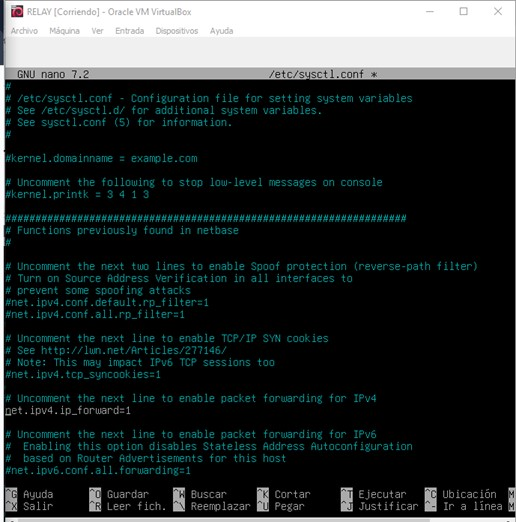

# Configuración del servidor RELAY

- Lo primero que debemos hacer es encender la máquina y descargarnos el paquete **isc-dhcp-relay**.7

- A continuación se nos abrirá en la pantalla una pestaña de color azul, en la primera pestaña debemos poner la ip de nuestro servidor DHCP.

- En la siguiente pestaña debemos poner las interfaces de red que vamos a configurar, en este caso la enp0s3 y enp0s8.

- En la siguiente pestaña no hay que añadir nada.

- Una vez descargado y configurado el paquete, cerramos la máquina y cambiamos la configuración de red.

Esta es la red del servidor DHCP.

Esta es la red del cliente.

- A continuación usamos el comando **nano /etc/network/interfaces** para configurar las redes de ambas máquinas (DHCP y cliente).

Address en RELAY = Gateway en SERVIDOR y CLIENTE.

- Reiniciamos el servicio con **systemctl restart networking**

- Después de hacer un **ip a** para comprobar que ya tenemos las ips, nos vamos al archivo **/etc/sysctl.conf** para habilitar el forwarding, descomentamos la línea de ipv4 forward. (reenvío de paquetes).

- Lo comrpobamos con el comando **sysctl -f /etc/sysctl.conf**

