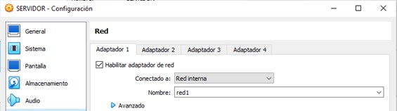

# Configuración del servidor DHCP

- Lo primero que debemos hacer es encender la máquina y descargarnos el paquete **isc-dhcp-server**.

- Una vez hecho, apagamos la máquina y cambiamosel adaptador de red a red interna, con el nombre de red1.

