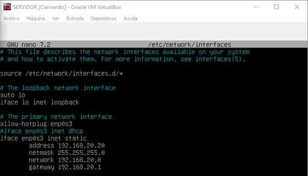

# Configuración del servidor DHCP

- Lo primero que debemos hacer es encender la máquina y descargarnos el paquete **isc-dhcp-server**.

- Una vez hecho, apagamos la máquina y cambiamosel adaptador de red a red interna, con el nombre de red1.

- Entramos en el archivo de configuración de las interfaces de red con el comando **sudo nano /etc/network/interfaces**, cambiamos al red a estática y le añadimos una ip.

- Hacemos **systemctl restart networking** y luego **ip a** para comprobar que se ha asignado correctamente.

## Después de configurar RELAY

- Para comprobar que hay conectividad entre el servidor DHCP y el cliente hacemos ping al cliente.

Podemos ver que sí hay conectividad.

- Una vez haya conectividad configuramos el archivo **/etc/default/isc-dhcp-server**, para
configurar la tarjeta que va a escuchar las peticiones del cliente.

